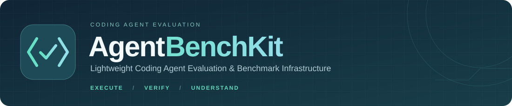
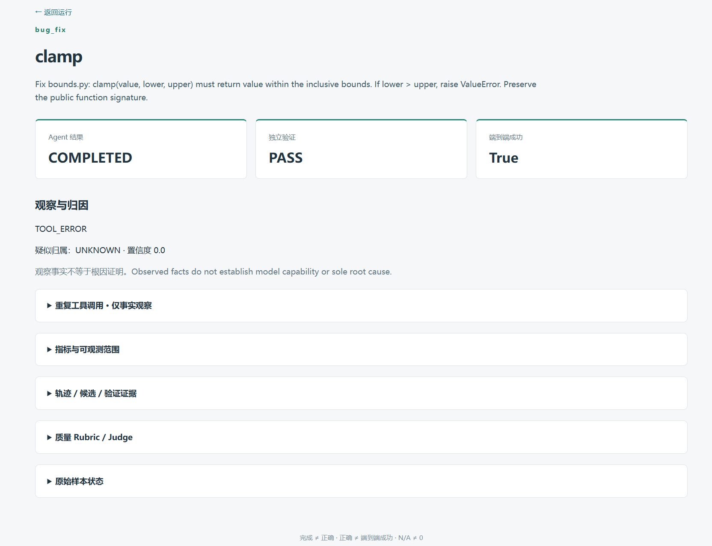
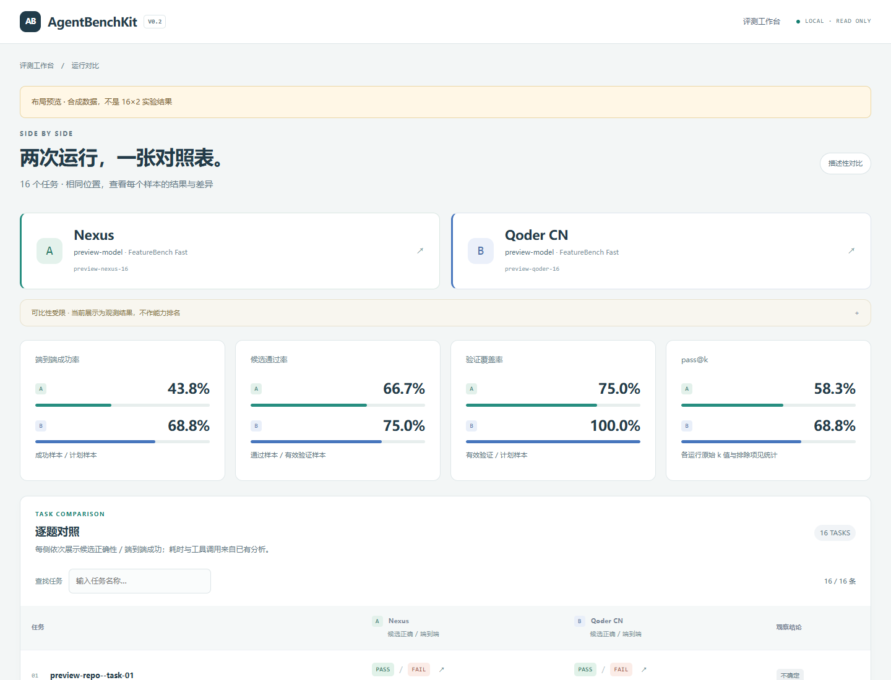
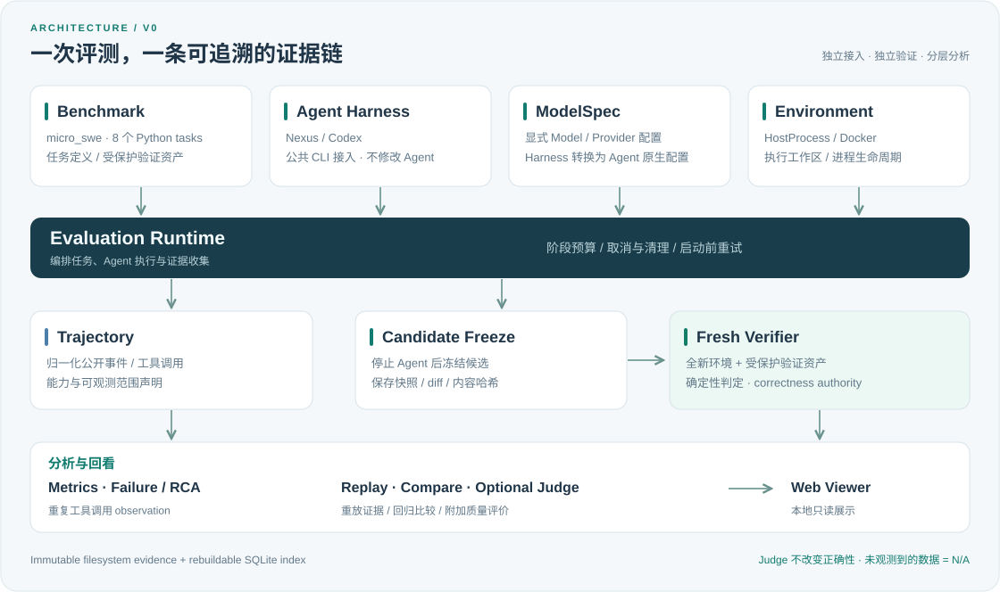

<p align="center">
  
</p>

<p align="center">
  <a href="pyproject.toml"></a>
  <a href="docs/adding-a-harness.md"></a>
  <a href="docs/limitations.md"></a>
  <a href="LICENSE"></a>
</p>

<p align="center"><b>每一步，都有据可循</b></p>

<p align="center">
  <a href="#quick-start">快速开始</a> ·
  <a href="#web-viewer">界面预览</a> ·
  <a href="#architecture">架构总览</a> ·
  <a href="docs/adding-a-harness.md">接入 Agent</a> ·
  <a href="docs/benchmarks.md">Benchmark 指南</a> ·
  <a href="docs/release-notes-v0.2.0.md">版本说明</a>
</p>

---

## 📖 项目简介

**AgentBenchKit** 是轻量、本地运行的 Coding Agent 评测工具。选择任务集和 Agent，
运行评测，在同一个界面查看任务结果、对比不同运行，并追溯代码修改与验证证据。

内置 **micro_swe、FeatureBench Fast、SWE-bench Lite、Aider Polyglot** 四种 Benchmark，
支持 **Nexus / Codex / Qoder CN**。公共 Benchmark 复用官方 evaluator 或测试流程，
Agent 通过公开 CLI / SDK 执行，无需修改其源码。

- **按需评测**：浏览任务目录，选择单题或任务集，配置模型、预算与执行环境。
- **集中看结果**：按运行汇总任务状态、候选正确性和端到端成功率，按需对比结果。
- **追溯每次执行**：保留轨迹、冻结候选、独立验证报告和分析记录。
- **扩展自己的 Agent**：通过 Harness 适配公开命令、配置与事件。

## 内置 Benchmark

| Benchmark | 完整任务目录 | 执行与判定 |
| --- | ---: | --- |
| [FeatureBench v1.1 Fast](docs/featurebench.md) | 100 | 官方 evaluator；提供固定 16 题 / 8 镜像实验集 |
| [SWE-bench Lite](docs/swe-bench-lite.md) | 300 | 官方 SWE-bench v4.1.0 evaluator |
| [Aider Polyglot](docs/aider-polyglot.md) | 225 | 单次 Agent + 官方测试；隐藏测试，不能直接对比官方两轮成绩 |
| micro_swe | 8 | 内置独立 verifier，适合本地回归 |

```sh
uv run agent-bench list benchmarks
uv run agent-bench tasks featurebench
uv run agent-bench make-config featurebench --all-tasks --output featurebench-plan.json
uv run agent-bench make-config swe-bench-lite --all-tasks --output swe-lite-plan.json
uv run agent-bench make-config aider-polyglot --all-tasks --output polyglot-plan.json
```

列任务与生成配置不会调用模型。运行前请选择任务，并按对应指南准备固定数据、官方源码和镜像。
公共 Benchmark 使用 Linux/WSL、Docker 和 ext4 工作目录。详见[Benchmark 使用指南](docs/benchmarks.md)。

<a id="web-viewer"></a>
## 🖥️ Web Viewer

一个运行页集中显示全部任务：指标总览、任务状态矩阵、逐题结果，以及搜索和 PASS / FAIL / N/A 筛选。
任务数量取决于所选任务集，每次运行都生成独立报告，不要求固定题数或重复运行。
工作台汇集运行记录；需要对比时，再任选两条记录查看指标与逐题差异。
需要定位原因时，可进入样本证据页面。
页面只读，保留正确性、端到端成功与可比性条件的区别。

<table>
  <tr>
    <td align="center" valign="top">
      <a href="docs/assets/viewer-overview.png"></a>
      <br><sub><b>评测运行总览</b><br>查看模型、环境、核心指标与任务结果</sub>
    </td>
    <td align="center" valign="top">
      <a href="docs/assets/viewer-compare.png"></a>
      <br><sub><b>运行结果对比</b><br>在同一页面比较指标与逐题结果</sub>
    </td>
  </tr>
</table>

<p align="center"><sub>界面演示 · 截图使用合成数据，题数与 Agent 仅作示例</sub></p>

<a id="architecture"></a>
## 🧭 架构总览

<p align="center">
  <a href="docs/assets/architecture-overview.svg"></a>
</p>

<details>
<summary>展开文字版执行链路</summary>

```text
Benchmark / Task + Agent Harness + Environment
                       ↓
                Evaluation Runtime
                       ↓
               Trajectory / Candidate
                       ↓
            Fresh Independent Verifier
                       ↓
                Metrics / Failure / RCA
                       ↓
       Replay / Compare / Optional Judge
                       ↓
                   Web Viewer
```

</details>

详细接口与冻结语义见 [V0.3.1 架构方案](docs/architecture-v0.3.1.md)。

## ✨ 核心能力

| 层次 | 提供什么 |
| --- | --- |
| 接入与配置 | Benchmark / Harness / Environment 解耦；Nexus / Codex / Qoder 三种 Harness；公共 ModelSpec 转原生配置、隔离 Agent HOME。 |
| 执行与验证 | HostProcess / Docker 整个 Agent 执行；阶段超时、取消、启动前重试；Candidate Freeze；全新 protected verifier。 |
| 结果与分析 | candidate_pass 与 sample_success 分离；pass@k / coverage / success rate；Trajectory Evaluation、Failure / RCA、重复工具调用 observation。 |
| 回归与质量 | 基于不可变 evidence 的 Replay；先检查实验条件的 Regression Compare；四维 Rubric + 可选 LLM Judge。 |
| 存储与展示 | 不可变文件证据 + 可重建 SQLite 索引；本地只读 Web Viewer，展示任务、轨迹、diff、判定与分析。 |

<a id="quick-start"></a>
## 🚀 Quick Start

需要 Python 3.12+、[uv](https://docs.astral.sh/uv/)、Git；容器运行需要 Docker Engine
或 Docker Desktop（Linux containers）。已配置模型账户与密钥；Agent 本体安装在执行环境中。

### 1. 从源码安装并检查 benchmark

```sh
git clone https://github.com/K529529/AgentBenchKit.git
cd AgentBenchKit
uv sync --locked
uv run agent-bench --help
uv run agent-bench validate-benchmark
```

`validate-benchmark` 在全部八题上确认 no-op 应失败、reference candidate 应通过，
不调用模型。

### 2. 准备 Nexus 镜像与模型配置

```sh
git clone https://github.com/K529529/Nexus.git ../Nexus
uv run python scripts/build_nexus_image.py ../Nexus
```

已有 Nexus Git checkout 可复用。构建脚本导出固定 v0.2.0 commit，不修改 Agent 源码，
不复制个人配置。检查并调整 [nexus-api.toml](examples/models/nexus-api.toml) 中的
模型 ID、Provider、endpoint、上下文窗口与预算；密钥只通过其引用的环境变量提供。
例如本机终端使用 PowerShell `$env:DASHSCOPE_API_KEY="<your-key>"`，
或 shell `export DASHSCOPE_API_KEY="<your-key>"`；不要将密钥写进配置或提交到 Git。

### 3. 跑一题，查看与重放

```sh
uv run agent-bench run micro_swe nexus --env docker --docker-image agentbenchkit-nexus:v0.2.0 --model-config examples/models/nexus-api.toml --task clamp
uv run agent-bench runs
uv run agent-bench view RUN_ID
uv run agent-bench replay RUN_ID
```

将 `RUN_ID` 替换为 `run` 输出的 ID。默认结果目录为 `.agentbenchkit/results`，
Viewer 监听 `127.0.0.1:8765`。`replay` 生成新分析版本，不重新执行 Agent。
`--samples` / `--k` 控制采样与 pass@k，`--concurrency` 控制并发；阶段预算见 `run --help`。

### 4. 比较两个 run，按需执行 Judge

```sh
uv run agent-bench compare BASELINE_RUN CANDIDATE_RUN
uv run agent-bench judge RUN_ID sample-clamp-1 --model qwen3.8-flash --endpoint https://maas.qianwenaiapi.com/compatible-mode/v1 --key-env DASHSCOPE_API_KEY --max-completion-tokens 8192 --reasoning-effort low
```

Compare 会标出模型、任务、环境等差异，不可比时返回 INCONCLUSIVE。
Judge 示例需要对应 endpoint 的访问资格；它会单独调用模型，
发送限量任务/代码/公开轨迹并计入 Judge usage。其他 Provider 请调整显式配置。
每次 Judge 生成独立 artifact，不改正确性；详见 [Judge 契约与证据](docs/judge-diagnostics.md)。

### Codex 与 HostProcess

Nexus 镜像构建完成后，可运行 `uv run python scripts/build_agents_image.py` 构建
`agentbenchkit-agents:v0`；该脚本需要 GitHub CLI 和网络，下载固定官方 Codex 0.155.1
完整 Linux x86_64 包。使用 [codex-api.toml](examples/models/codex-api.toml) 前替换
模型占位符，或按 [模型与认证说明](docs/model-contract.md) 跑 ChatGPT 登录 smoke。

HostProcess 通过 `--env host_process` 使用本机 Agent，仅适合可信本地调试。
`--nexus-executable` / `--codex-executable` 可指定可执行文件。

## 🛠️ CLI 心智模型

| 命令 | 作用 |
| --- | --- |
| `run` | 发起 Agent 执行、候选收集、独立验证与初始分析。 |
| `view` | 本地查看已有 run 和证据。 |
| `replay` | 基于已有 evidence 重新分析，不重新运行 Agent，也不覆盖历史分析。 |
| `judge` | 事后调用独立模型，进行附加四维 Rubric 评分。 |
| `compare` | 比较两个 run 的条件与结果，报告回归或不可比原因。 |

## 🛡️ Trust / Evaluation Boundaries

- Agent completion ≠ candidate correctness；candidate correctness ≠ end-to-end success。
- Deterministic verifier 是 correctness authority；LLM Judge 只能增加质量评价。
- Observation ≠ Root Cause：RCA 有证据与置信度，属于启发式判断。
- Missing observability = N/A，不能伪装成 token/tool/cost 为 0。
- 文件证据是事实来源；SQLite 可重建。失败物理执行、历史分析与 Judge 记录均保留。

## 🔌 Adding a new Agent

已支持的 Nexus / Codex / Qoder 可直接运行；未知 Agent 需要适配其公开命令、配置和事件。
Harness 通过源码扩展，不要求修改被评测 Agent。CLI 提供上表四种 Benchmark；
新增 Benchmark 需要开发并注册 Adapter，不是通过配置文件上传任意题库。
见 [接入指南](docs/adding-a-harness.md) 和
[可运行 Harness 示例](examples/custom_harness.py)。

## 📌 Current scope / limitations

- micro_swe 有 8 道小型 Python 任务；FeatureBench Fast / SWE-bench Lite / Polyglot 已接入，完整 catalog 分别为 100 / 300 / 225 题。具体运行覆盖见版本说明。
- Codex ChatGPT 登录属于 smoke，不用于正式同模型公平比较；真实 Codex 显式 API inference 尚未执行。
- Docker 不是 hostile-code 强隔离，Agent 可访问自身推理凭据；HostProcess 没有文件系统沙箱。
- micro_swe 候选仅支持有界 UTF-8 文本，不支持 binary、symlink、junction；public Git-patch 支持 binary、删除和安全仓库 symlink。Polyglot 仅收集允许的普通 solution 文件，并保护内嵌官方测试。Windows bind mount 不保证 POSIX 执行位。
- 重复工具调用是 observation；Stagnation 因逐步 mutation 证据不足未实现。
- 公开事件和可配置模型参数有 Agent 差异；配置相同不自动证明实验公平可比。

更多边界见 [limitations](docs/limitations.md)、[ModelSpec](docs/model-contract.md) 和
[trajectory analyzers](docs/trajectory-analyzers.md)。

## ✅ 验证与版本记录

项目在 Windows 与 Ubuntu 上执行自动化测试；Docker 与官方 Benchmark controls 单独验证。

- [CI 状态](https://github.com/K529529/AgentBenchKit/actions/workflows/ci.yml)
- [V0.2 版本说明与验证结果](docs/release-notes-v0.2.0.md)
- [完整验收记录](docs/implementation-status.md)

## 📄 License

[MIT](LICENSE)。随包 HTMX 的第三方许可见
[HTMX-LICENSE.txt](src/agentbenchkit/viewer/static/htmx-LICENSE.txt)。
